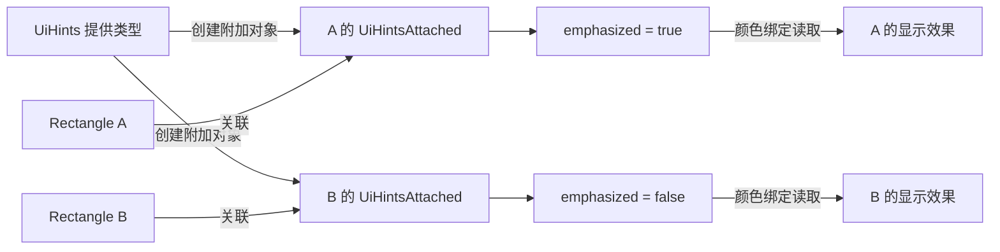

# Qt QML 附加属性与 WPF 对照

## 1. 文档目标

本文面向熟悉 WPF、正在学习 Qt Quick/QML 的开发者，以 Qt 6.8 为基线，说明附加属性的使用、对象关系、自定义实现和跨框架差异。代码均为独立教学示例，不代表本仓库包含对应应用工程。

附加属性并非 WPF 独有。Qt/QML 有原生的 attached properties 和 attached signal handlers，WinUI 也有 XAML 附加属性。本文重点对照 Qt 与 WPF，不把其他框架的布局参数或扩展函数一概称为同一种机制。[WinUI 官方参考](https://learn.microsoft.com/en-us/windows/apps/develop/platform/xaml/attached-properties-overview)

学习目标：

- 看懂 `Layout.fillWidth`、`Keys.onReturnPressed`、`ListView.isCurrentItem` 和 `Component.onCompleted`；
- 分清提供类型、目标对象、附加对象以及消费方；
- 理解类型名前缀为什么不表示全局共享状态；
- 使用 C++ 定义 QML 附加属性，并与 WPF `RegisterAttached` 对照；
- 判断什么时候用普通属性、组件接口或附加属性。

前置知识：

- [Qt Q_PROPERTY 与跨平台双向绑定对照](Qt%20Q_PROPERTY与跨平台双向绑定对照.md)：属性存储、通知、绑定以及 alias。
- [Qt QML Signal 与分层事件流](Qt%20QML%20Signal与分层事件流.md)：普通信号、属性通知和用户意图。
- [Qt 元对象系统与 QML 类型注册](Qt元对象系统与QML类型注册.md)：`moc`、元对象以及 QML 类型注册。

## 2. 为什么属性写在别人的对象上

### 2.1 从 Layout.fillWidth 看问题

```qml
import QtQuick
import QtQuick.Layouts

RowLayout {
    width: 320
    height: 60

    Rectangle {
        implicitWidth: 80
        implicitHeight: 40
        color: "steelblue"
        Layout.fillWidth: true
    }
}
```

`Rectangle` 有 `color`，但其普通属性列表中没有 `fillWidth`。这里的 `Layout.fillWidth` 来自 `QtQuick.Layouts` 中的 `Layout` 提供类型，附加到这个 Rectangle 实例上，由外层 RowLayout 读取。

三个问题要分别回答：

| 问题 | 此例的答案 |
| --- | --- |
| 谁定义这种附加信息 | `Layout` 提供类型 |
| 这份值描述哪个对象 | 当前 Rectangle 实例 |
| 谁读取并使用它 | 管理该子项的 RowLayout |

所以它表达的是“这个子项愿意使用可分配的额外宽度”，布局容器据此安排几何尺寸；它不是 RowLayout 自己的普通 `fillWidth` 属性。

### 2.2 Qt 的附加对象模型

QML 访问某个提供类型的附加成员时，会为目标实例取得相应附加对象。该对象保存属性并提供信号；引擎缓存它，后续访问同一目标、同一提供类型会使用同一对象。



`UiHints` 是访问前缀和工厂提供者；A、B 的状态各自存在其附加对象里。Qt 不需要向 Rectangle 类新增成员，也不要求 Rectangle 继承 UiHints。

“附加对象”也不等于“父控件”：一个键盘处理提供类型或元数据提供类型，并不需要作为目标对象的视觉父项出现。自定义附加对象通常以目标为 QObject 父对象，这解决所有权与销毁问题，不代表视觉布局关系。[Qt 自定义附加对象官方参考](https://doc.qt.io/qt-6.8/qtqml-cppintegration-definetypes.html#providing-attached-properties)

### 2.3 声明数据与产生行为是两步

给对象设置一份附加信息，只是提供数据。布局容器、绑定、样式或服务读取它后，才会产生实际行为。

```text
子对象声明布局要求
    ↓
附加对象保存要求
    ↓
布局容器读取子对象的要求
    ↓
布局容器计算并设置尺寸
```

把 `Layout.fillWidth: true` 写到不受 Qt Quick Layouts 管理的 Item 上，不会自动让它填满普通 Item 父对象；普通 Item 没有对应的布局消费逻辑。

## 3. 常见 Qt 内置用法

### 3.1 Layout：把布局要求交给容器

```qml
// LayoutDemo.qml
import QtQuick
import QtQuick.Layouts

Item {
    width: 320
    height: 80

    RowLayout {
        anchors.fill: parent
        spacing: 8

        Rectangle {
            objectName: "fixed"
            implicitWidth: 80
            implicitHeight: 40
            Layout.fillWidth: false
            Layout.fillHeight: false
            color: "lightgray"
        }
        Rectangle {
            objectName: "stretch"
            implicitWidth: 80
            implicitHeight: 40
            Layout.fillWidth: true
            Layout.fillHeight: false
            color: "steelblue"
        }
    }
}
```

第一个子项保持首选宽度，第二个参与额外宽度分配。`fillWidth` 仍受最小、首选和最大尺寸等约束，不表示忽略约束直接设置 `width = parent.width`。

`GridLayout` 中，子项通过附加属性选择格子和跨度：

```qml
// GridDemo.qml
import QtQuick
import QtQuick.Layouts

GridLayout {
    width: 320
    height: 100
    columns: 2
    rowSpacing: 8
    columnSpacing: 8

    Rectangle {
        objectName: "rightCell"
        implicitWidth: 80
        implicitHeight: 32
        Layout.row: 0
        Layout.column: 1
        Layout.fillWidth: true
        color: "steelblue"
    }
    Rectangle {
        objectName: "leftCell"
        implicitWidth: 80
        implicitHeight: 32
        Layout.row: 0
        Layout.column: 0
        Layout.fillWidth: true
        color: "lightgray"
    }
    Rectangle {
        objectName: "wideCell"
        implicitHeight: 32
        Layout.row: 1
        Layout.column: 0
        Layout.columnSpan: 2
        Layout.fillWidth: true
        color: "lightgreen"
    }
}
```

注意：直接由布局管理的子项，不要同时用 `anchors` 或持续绑定的 `width`、`height` 与布局争夺几何控制；优先提供 `implicitWidth` / `implicitHeight` 或 `Layout.preferredWidth` / `Layout.preferredHeight`。上例给 RowLayout 自身设置 anchors，它的父对象是普通 Item，与子项由 RowLayout 管理并不冲突。[Layout 官方参考](https://doc.qt.io/qt-6.8/qml-qtquick-layouts-layout.html)

### 3.2 Keys：附加属性与附加信号一起使用

```qml
// KeysDemo.qml
import QtQuick

Item {
    id: root
    width: 240
    height: 80
    focus: true
    property int returnCount: 0
    property bool keyHandlingEnabled: true

    Keys.enabled: root.keyHandlingEnabled
    Keys.onReturnPressed: function(event) {
        root.returnCount += 1
        event.accepted = true
    }

    Text { text: "回车次数：" + root.returnCount }
}
```

这里有两类附加成员：

| 写法 | 类型 | 含义 |
| --- | --- | --- |
| `Keys.enabled` | 附加属性 | 当前对象是否启用 Keys 处理 |
| `Keys.onReturnPressed` | 附加信号处理器 | 当前对象收到对应按键时执行逻辑 |

实际运行时需要把 Item 放在活动窗口的焦点链中，确保它具有 active focus 或按键经过相应传播路径；`focus: true` 不是绕过窗口和焦点作用域的全局键盘监听。必要时可以调用 `forceActiveFocus()`。Keys 也有事件处理优先级和转发规则，不能把它等同于任意事件的广播订阅。[Keys 官方参考](https://doc.qt.io/qt-6.8/qml-qtquick-keys.html)

### 3.3 ListView：附加状态属于 delegate 根对象

```qml
// DelegateDemo.qml
import QtQuick

ListView {
    width: 240
    height: 120
    model: 3
    currentIndex: 0

    delegate: Item {
        id: delegateRoot
        required property int index
        objectName: "delegate" + index
        width: 240
        height: 32
        readonly property bool current: ListView.isCurrentItem

        Rectangle {
            objectName: "indicator"
            anchors.fill: parent
            color: delegateRoot.ListView.isCurrentItem ? "tomato" : "lightgray"
        }
    }
}
```

delegate 根 Item 是 ListView 管理的实例，它对应的 `ListView.isCurrentItem` 由视图更新。内层 Rectangle 应通过 `delegateRoot.ListView.isCurrentItem` 访问这一份状态。

如果内层直接写：

```qml
color: ListView.isCurrentItem ? "tomato" : "lightgray" // 错误用法示例
```

访问的会是内层 Rectangle 自己的附加上下文，并非根 Item 的状态。它通常不会得到预期的当前项效果；这不是语法错误，而是把状态附加到哪个对象理解错了。

上述 `current` 普通只读属性还可以作为根组件的明确输出，供内部子项读取 `delegateRoot.current`。不要依赖父项的附加值自动下传。[ListView 附加属性参考](https://doc.qt.io/qt-6.8/qml-qtquick-listview.html#attached-property-documentation)、[Qt 对嵌套访问的说明](https://doc.qt.io/qt-6.8/qtqml-syntax-objectattributes.html#a-note-about-accessing-attached-properties-and-signal-handlers)

### 3.4 Component：生命周期附加信号处理器

```qml
// ComponentDemo.qml
import QtQuick

Item {
    id: root
    property bool initialized: false

    Component.onCompleted: {
        root.initialized = true
        console.log("当前对象已完成创建")
    }
    Component.onDestruction: console.log("当前对象正在销毁")
}
```

`Component.onCompleted` 是当前对象上 `Component.completed` 的附加信号处理器；不是必须先写一个 `Component {}` 对象，也不是所有实例共用的全局回调。

多个对象的 completed 处理器不保证固定执行顺序，不应把它当成依赖其他对象处理器已经执行的初始化屏障。它与 WPF `Loaded` 可以在用途上比较，但创建完成、加载到呈现树和生命周期重复触发条件并不相同。[Component 官方参考](https://doc.qt.io/qt-6.8/qml-qtqml-component.html#attached-signal-documentation)

## 4. 看起来相似的语法分别是什么

| 机制 | 示例 | 属性或状态从哪里来 |
| --- | --- | --- |
| 普通属性 | `rect.color` | 目标类型自身或基类定义 |
| 分组属性 | `label.font.pixelSize`、`item.anchors.left` | 目标本来就有 `font` 或 `anchors`，再访问其成员 |
| alias | `property alias text: input.text` | 为已有属性建立另一访问入口，不创建第二份状态 |
| 附加属性 | `rect.Layout.fillWidth` | 提供类型的附加对象保存目标实例的状态 |
| 附加信号处理器 | `Keys.onReturnPressed` | 处理目标实例的附加对象所提供的信号 |
| QObject 动态属性 | `object->setProperty("tag", value)`，且原来没有该属性 | 运行时加入 QObject 的动态属性，不自动构成带通知的 QML 附加 API |
| QML 单例 | `AppSettings.theme` | 某个单例对象提供共享访问，与每个目标实例的附加状态不同 |

所以“有一个点号”不能用来判断是否为附加属性，必须看前缀究竟是目标对象已有的属性、某个对象实例、单例还是附加属性提供类型。

QML 不能用普通 `property` 声明把一个纯 QML 组件自动变成通用附加属性提供类型。本文使用 C++ 提供附加对象，再交给 QML 注册与绑定系统处理。alias 也不能直接指向附加属性；如果只需要读取，使用普通属性绑定，例如 `readonly property bool current: ListView.isCurrentItem`。

## 5. 自定义 Qt 附加属性：UiHints.emphasized

### 5.1 示例约定

为任何需要这份界面提示的 QObject 提供一个布尔属性：Qt 写作 `UiHints.emphasized`，WPF 写作 `UiHints.Emphasized`，遵循各自命名习惯，语义相同。

默认值为 `false`，取值为 `true` 时由示例的颜色绑定或样式显示强调效果。提供类型只负责保存和通知这份信息，不主动操作控件颜色。

最小 Qt 示例由四个文件组成：

```text
AttachedDemo/
├── CMakeLists.txt
├── main.cpp
├── uihints.h
└── Main.qml
```

### 5.2 定义附加对象与提供类型

```cpp
// uihints.h
#pragma once

#include <QObject>
#include <QtQml/qqmlregistration.h>

class UiHintsAttached : public QObject
{
    Q_OBJECT
    QML_ANONYMOUS
    Q_PROPERTY(bool emphasized READ emphasized WRITE setEmphasized
               NOTIFY emphasizedChanged)

public:
    explicit UiHintsAttached(QObject *parent = nullptr)
        : QObject(parent)
    {
    }

    bool emphasized() const { return m_emphasized; }

    void setEmphasized(bool value)
    {
        if (m_emphasized == value) {
            return;
        }
        m_emphasized = value;
        emit emphasizedChanged();
    }

signals:
    void emphasizedChanged();

private:
    bool m_emphasized = false;
};

class UiHints : public QObject
{
    Q_OBJECT
    QML_ELEMENT
    QML_UNCREATABLE("UiHints 只能作为附加属性使用")
    QML_ATTACHED(UiHintsAttached)

public:
    static UiHintsAttached *qmlAttachedProperties(QObject *target)
    {
        return new UiHintsAttached(target);
    }
};
```

职责对应：

| 声明或类型 | 职责 |
| --- | --- |
| `UiHintsAttached` | 保存每个目标的属性，并提供 `emphasizedChanged` |
| `QML_ANONYMOUS` | 把附加对象类型的元信息提供给 QML，不给调用方一个可直接实例化的类型名 |
| `UiHints` | 提供 `UiHints.` 访问前缀和附加对象工厂 |
| `QML_ELEMENT` | 将 UiHints 注册进所属 QML 模块 |
| `QML_UNCREATABLE` | 禁止调用方直接写 `UiHints {}`，仍允许访问附加成员 |
| `QML_ATTACHED(UiHintsAttached)` | 声明该提供类型的附加对象类型 |
| `qmlAttachedProperties(target)` | 创建属于该目标的附加对象，以目标为 QObject 父对象 |

这段代码沿用普通属性的 Getter、Setter、存储和 `NOTIFY`；额外增加的是“为其他对象提供实例状态”的注册与工厂层。[Qt 附加对象实现参考](https://doc.qt.io/qt-6.8/qtqml-cppintegration-definetypes.html#implementing-attached-objects-an-example)

### 5.3 模块注册与启动

```cmake
# CMakeLists.txt
cmake_minimum_required(VERSION 3.21)
project(AttachedDemo LANGUAGES CXX)

set(CMAKE_CXX_STANDARD 17)
set(CMAKE_CXX_STANDARD_REQUIRED ON)

find_package(Qt6 6.8 REQUIRED COMPONENTS Quick QuickControls2)
qt_standard_project_setup(REQUIRES 6.8)

qt_add_executable(appAttached main.cpp)
qt_add_qml_module(appAttached
    URI Learning.Attached
    VERSION 1.0
    QML_FILES Main.qml
    SOURCES uihints.h
)
target_link_libraries(appAttached PRIVATE Qt6::Quick Qt6::QuickControls2)
```

`uihints.h` 进入模块的 `SOURCES` 后，Qt 构建流程会处理元对象和 QML 注册信息；仅在头文件里写宏、却不让构建系统处理它，并不能完成注册。

```cpp
// main.cpp
#include <QGuiApplication>
#include <QQmlApplicationEngine>

int main(int argc, char *argv[])
{
    QGuiApplication app(argc, argv);
    QQmlApplicationEngine engine;
    QObject::connect(&engine, &QQmlApplicationEngine::objectCreationFailed,
                     &app, [] { QCoreApplication::exit(1); },
                     Qt::QueuedConnection);
    engine.loadFromModule("Learning.Attached", "Main");
    return app.exec();
}
```

教学目录中配置、构建和运行：

```bash
cmake -S . -B build -DCMAKE_PREFIX_PATH="你的 Qt 6.8 安装目录"
cmake --build build
./build/appAttached
```

命令中的安装目录必须替换为实际 Qt kit；Windows 的可执行文件位置随生成器和构建配置变化。这里不展开安装包部署。

### 5.4 使用属性，并明确编写消费逻辑

```qml
// Main.qml
import QtQuick
import QtQuick.Controls
import Learning.Attached

ApplicationWindow {
    width: 360
    height: 220
    visible: true
    title: "附加属性示例"

    Column {
        anchors.centerIn: parent
        spacing: 12

        CheckBox {
            id: emphasis
            objectName: "emphasis"
            text: "强调第一个方块"
        }
        Row {
            spacing: 12

            Rectangle {
                id: first
                objectName: "first"
                width: 120
                height: 60
                UiHints.emphasized: emphasis.checked
                color: first.UiHints.emphasized ? "tomato" : "lightgray"
                UiHints.onEmphasizedChanged: console.log("第一个方块的强调状态变化")
                Text { anchors.centerIn: parent; text: "第一个" }
            }
            Rectangle {
                id: second
                objectName: "second"
                width: 120
                height: 60
                // 没有设置附加值，读取时得到自身附加对象的默认 false。
                color: second.UiHints.emphasized ? "tomato" : "lightgray"
                Text { anchors.centerIn: parent; text: "第二个" }
            }
        }
    }
}
```

勾选复选框后，只有第一个方块变色：

```text
emphasis.checked 变化
    ↓
first 的 UiHintsAttached.setEmphasized()
    ↓
first 的附加对象更新状态并发出 emphasizedChanged()
    ↓
first.color 的绑定重新计算
    ↓
第一个方块变为 tomato
```

`second` 有自己的附加对象，不会读取 first 的值。若删掉 `color` 绑定，附加值仍会变化，但方块不会自动变色；显示效果由消费方决定。

附加属性参与的绑定仍是普通 QML 单向依赖，不会自动反向同步到复选框。直接对 `first.UiHints.emphasized` 赋静态值，还可能覆盖它对 `emphasis.checked` 的绑定。

### 5.5 C++ 访问已有附加对象或请求创建

```cpp
// 教学片段：目标非空，提供类型已正确注册
#include "uihints.h"
#include <QtQml/qqml.h>

void updateHint(QObject *target)
{
    if (!target) {
        return;
    }

    auto *existing = qobject_cast<UiHintsAttached *>(
        qmlAttachedPropertiesObject<UiHints>(target, false));
    if (existing) {
        // false 表示只查询：没有实例时返回 nullptr，不调用工厂。
        const bool wasEmphasized = existing->emphasized();
        Q_UNUSED(wasEmphasized);
    }

    auto *attached = qobject_cast<UiHintsAttached *>(
        qmlAttachedPropertiesObject<UiHints>(target, true));
    if (attached) {
        // 已有实例则复用；否则通过工厂创建并关联到这个 target。
        attached->setEmphasized(true);
    }
}
```

模板参数是提供类型 `UiHints`，不是 `UiHintsAttached`。`create` 参数默认是 `true`；检查某对象是否已有附加状态时，应明确传 `false`，避免查询动作意外创建对象。

不要直接反复调用 `UiHints::qmlAttachedProperties(target)` 来代替这个 API：直接调用工厂会自行 new 新对象，绕过引擎的关联缓存。也不要在目标存活期间手动删除引擎缓存的附加对象；本例通过 QObject 父子所有权，在目标销毁时一起销毁附加对象。[qmlAttachedPropertiesObject 官方参考](https://doc.qt.io/qt-6.8/qqml-h.html#qmlAttachedPropertiesObject)

## 6. WPF 对照：Attached Dependency Property

### 6.1 Grid.Row 与 DockPanel.Dock

WPF 同样允许在子控件上写由其他类型定义的附加属性：

```xml
<Grid>
    <Grid.RowDefinitions>
        <RowDefinition Height="Auto" />
        <RowDefinition Height="*" />
    </Grid.RowDefinitions>
    <TextBlock Grid.Row="0" Text="标题" />
    <TextBox Grid.Row="1" Text="内容" />
</Grid>
```

```xml
<DockPanel LastChildFill="True">
    <Button DockPanel.Dock="Top" Content="工具栏" />
    <TextBox Text="剩余区域" />
</DockPanel>
```

`Grid.Row` 的值记录在具体子对象上，由 Grid 布局读取；`DockPanel.Dock` 由 DockPanel 的布局逻辑读取。类型名前缀并不意味着所有控件共享一个行号或停靠位置。

C# 通过静态访问函数指定目标：

```csharp
Grid.SetRow(textBox, 1);
int row = Grid.GetRow(textBox);
DockPanel.SetDock(button, Dock.Top);
```

给不在 DockPanel 布局中的控件设置 `DockPanel.Dock` 可以保存值，却不会凭空创建停靠布局；这与 Qt 布局附加信息需要对应容器消费的关系相近。[WPF 附加属性官方参考](https://learn.microsoft.com/en-us/dotnet/desktop/wpf/properties/attached-properties-overview)

### 6.2 自定义同一份强调提示

以下代码用于 Windows 上的 WPF 项目。可从 `dotnet new wpf -n AttachedDemo` 生成的标准项目开始：新增 `UiHints.cs`，替换 `MainWindow.xaml`，保留模板中同名的窗口 code-behind 和 App 启动配置。命名空间统一为 `AttachedDemo`。

```csharp
// UiHints.cs
using System.Windows;

namespace AttachedDemo
{
    public static class UiHints
    {
        public static readonly DependencyProperty EmphasizedProperty =
            DependencyProperty.RegisterAttached(
                "Emphasized",
                typeof(bool),
                typeof(UiHints),
                new FrameworkPropertyMetadata(false));

        public static bool GetEmphasized(DependencyObject target)
            => (bool)target.GetValue(EmphasizedProperty);

        public static void SetEmphasized(DependencyObject target, bool value)
            => target.SetValue(EmphasizedProperty, value);
    }
}
```

静态 `EmphasizedProperty` 是属性标识，`GetEmphasized` / `SetEmphasized` 是访问入口。调用时传入具体 `DependencyObject`，属性系统取得该目标上的值或默认值；静态字段没有存储所有控件共用的 bool。

本例不用独立附加 QObject 保存值，而是使用 WPF 依赖属性系统。用于其他类型的附加属性提供类本身不必继承 DependencyObject，但目标需要符合相应访问器的类型要求。[WPF 注册附加属性参考](https://learn.microsoft.com/en-us/dotnet/desktop/wpf/properties/how-to-register-an-attached-property)

### 6.3 用 Style Trigger 消费附加值

```xml
<!-- MainWindow.xaml -->
<Window x:Class="AttachedDemo.MainWindow"
        xmlns="http://schemas.microsoft.com/winfx/2006/xaml/presentation"
        xmlns:x="http://schemas.microsoft.com/winfx/2006/xaml"
        xmlns:local="clr-namespace:AttachedDemo"
        Title="附加属性示例" Width="360" Height="220">
    <Window.Resources>
        <Style x:Key="HintBox" TargetType="Border">
            <Setter Property="Background" Value="LightGray" />
            <Style.Triggers>
                <Trigger Property="local:UiHints.Emphasized" Value="True">
                    <Setter Property="Background" Value="Tomato" />
                </Trigger>
            </Style.Triggers>
        </Style>
    </Window.Resources>
    <StackPanel HorizontalAlignment="Center" VerticalAlignment="Center">
        <CheckBox x:Name="Emphasis" Content="强调第一个方块" Margin="0,0,0,12" />
        <StackPanel Orientation="Horizontal">
            <Border Width="120" Height="60" Style="{StaticResource HintBox}"
                    local:UiHints.Emphasized="{Binding IsChecked, ElementName=Emphasis, Mode=OneWay}">
                <TextBlock Text="第一个" HorizontalAlignment="Center" VerticalAlignment="Center" />
            </Border>
            <Border Width="120" Height="60" Margin="12,0,0,0" Style="{StaticResource HintBox}">
                <TextBlock Text="第二个" HorizontalAlignment="Center" VerticalAlignment="Center" />
            </Border>
        </StackPanel>
    </StackPanel>
</Window>
```

与 Qt 示例一样，第一个 Border 的附加值依赖复选框，第二个使用自己的默认 `false`。Trigger 消费强调提示，设置 Background；删除 Trigger 后，附加值本身仍可读取，但不会自动影响背景。

需要服务型行为时，WPF 可以在注册元数据中使用 `PropertyChangedCallback` 执行业务相关接线，而不是只依赖样式。不能只在静态 Set 方法里添加副作用并假定所有绑定、样式或动画写入都会经过该包装方法。本例的通知与 Trigger 重新评估由依赖属性系统负责，不需要 `INotifyPropertyChanged`。

## 7. 两套机制的共同点与边界

| 能力 | Qt/QML | WPF |
| --- | --- | --- |
| 声明语法 | `UiHints.emphasized: true` | `local:UiHints.Emphasized="True"` |
| 提供者 | 已注册的附加属性提供类型 | 附加属性所属类型及属性标识 |
| 目标 | 支持相应提供者语义的 QObject 实例 | 符合访问器要求的 DependencyObject 实例 |
| 值的存储 | 关联到目标的附加 QObject | 目标上的依赖属性有效值及默认元数据 |
| 读取与写入 | QML 附加访问、C++ 附加对象 API | 静态 Get/Set、GetValue/SetValue |
| 默认值 | 附加对象的初始化实现 | 注册或覆盖的属性元数据 |
| 变化通知 | 附加对象的 `NOTIFY`，或其他受支持的属性通知机制 | 依赖属性系统、元数据回调 |
| 界面响应 | QML Binding、容器或服务 | Binding、Style/Trigger、容器或服务 |
| 生命周期 | 本例附加对象由目标的 QObject 所有权管理 | 属性值依附于目标对象及 WPF 属性系统，引用由 .NET 生命周期管理 |
| 继承与传播 | 普通附加对象不自动向子项传播 | 值继承需显式选择相应元数据，并受属性系统规则约束 |
| 事件机制 | 可以提供附加 signal 与处理器 | 附加属性与附加事件/路由事件是不同概念 |

最接近的共同点是：**无需修改目标类，就能向具体目标实例声明由其他类型定义的信息。**

两端都能用这份信息表达布局要求、界面提示或服务配置，但底层存储、绑定、线程、对象树和生命周期机制不同。Qt 元对象属性不具备 WPF 依赖属性整套值优先级、样式和动画规则，不能直接把两个系统当成等价实现。

## 8. 继承、传播与事件不是自动附赠的能力

### 8.1 父对象的值不会天然成为子对象的值

在第 5 章的实现中，父对象 `UiHints.emphasized = true` 不会自动让内部 Text 的 `UiHints.emphasized` 也为 true。子对象首次读取时取得自己的附加对象及默认值。

需要复用父项信息时，可以显式绑定到指定对象的附加属性，或公开一个普通组件属性。需要完整的主题/样式传播机制时，应单独设计传播实现；Qt 提供 `QQuickAttachedPropertyPropagator` 作为相关扩展工具，本文不实现传播系统。[Qt 附加属性传播参考](https://doc.qt.io/qt-6.8/qquickattachedpropertypropagator.html)

WPF 也不是所有附加属性都自动继承。自定义依赖属性需要在适当的 FrameworkPropertyMetadata 中选择 `Inherits`，继承结果还受对象树边界与本地值等优先级影响。第 6 章的 UiHints 未设置此标志，因此不承诺子对象继承它。[WPF 属性值继承参考](https://learn.microsoft.com/en-us/dotnet/desktop/wpf/properties/property-value-inheritance)

### 8.2 附加信号不等于路由事件

Qt 自定义附加对象可以声明信号，例如 `emphasizedChanged`；`UiHints.onEmphasizedChanged` 处理当前目标关联的那个附加对象发出的信号。

WPF 路由事件的冒泡、隧道和直接路由是另一套规则，不能根据“附加”二字推断 Qt signal 会沿视觉树传播。Keys 的按键处理有专门的事件传播机制，也不代表所有附加 signal 都具备 Keys 的行为。[WPF 路由事件参考](https://learn.microsoft.com/en-us/dotnet/desktop/wpf/events/routed-events-overview)

## 9. 选择准则与常见错误

### 9.1 什么时候值得用附加属性

| 场景 | 优先选择 |
| --- | --- |
| 数据属于某个 ViewModel 的业务状态 | 普通 `Q_PROPERTY` |
| 值属于自定义 QML 组件的输入或派生输出 | 普通 `property`、`required` 或 `readonly` |
| 暴露组件内部已有属性 | `alias` |
| 多种已有控件都需要声明同一份布局或服务提示，且不应修改各目标类 | 附加属性 |
| 多个页面访问共享配置 | 单例或明确注入的配置对象 |
| 需要调用业务操作 | 明确方法或用户意图信号 |

不要为了少写一个组件属性而引入附加对象。附加属性最有价值的地方，是提供者与目标类型解耦，同时让独立的容器、样式或服务有统一的信息入口。

### 9.2 常见错误

1. **把类型前缀当成静态共享状态**：`Layout` 或 `UiHints` 提供访问机制，值仍属于目标实例。
2. **写错目标位置**：布局信息应写在对应容器管理的子项上，嵌套 delegate 的状态应从根对象读取。
3. **只声明属性，没有消费方**：自定义提示不会自动变色，布局附加值也不会在普通 Item 父项中自动生效。
4. **把分组属性都叫附加属性**：`font.pixelSize` 和 `Layout.fillWidth` 的点号外观相似，来源不同。
5. **忘记通知或重复通知**：传统附加 `Q_PROPERTY` 仍要在值变化时正确发出 `NOTIFY`，相同值不要重复发出。
6. **每次访问都直接 new 或调用工厂**：使用引擎的附加对象查询入口，复用同一目标的关联实例。
7. **把附加对象提前删除**：本例让目标管理其生命周期，不手动破坏引擎缓存的对象。
8. **把 Keys 当全局快捷键系统**：检查活动窗口、焦点、enabled 和事件接受状态。
9. **把附加属性当自动双向绑定、值继承或事件路由**：这些能力各有自己的实现条件。

## 10. 验证范围与进一步阅读

本文代码块已提取到临时工程，用本机 Qt 6.8.3 编译和运行验证。6 个 QML 示例通过 `qmllint`，43 项行为检查通过，覆盖自定义模块注册、默认值、实例隔离、重复访问、绑定刷新、通知、生命周期，以及内置布局、delegate 和按键焦点。

运行检查使用离屏窗口、软件渲染和 Qt Quick Controls 的 Basic 样式，以避开离屏环境下的 macOS 原生样式绘制限制；本次验证不覆盖原生样式绘制和应用打包部署。

WPF 示例依据 Microsoft 官方 API 与 XAML 用法核对，XML 结构检查通过，需要 Windows WPF 项目运行环境；本机 macOS 未进行 WPF 编译与运行验证。

相关官方资料：

- [QML 附加属性与附加信号处理器](https://doc.qt.io/qt-6.8/qtqml-syntax-objectattributes.html#attached-properties-and-attached-signal-handlers)
- [C++ 提供 QML 附加属性](https://doc.qt.io/qt-6.8/qtqml-cppintegration-definetypes.html#providing-attached-properties)
- [Qt 附加对象查询 API](https://doc.qt.io/qt-6.8/qqml-h.html#qmlAttachedPropertiesObject)
- [WPF 附加属性概览](https://learn.microsoft.com/en-us/dotnet/desktop/wpf/properties/attached-properties-overview)
- [WPF 注册附加属性](https://learn.microsoft.com/en-us/dotnet/desktop/wpf/properties/how-to-register-an-attached-property)
