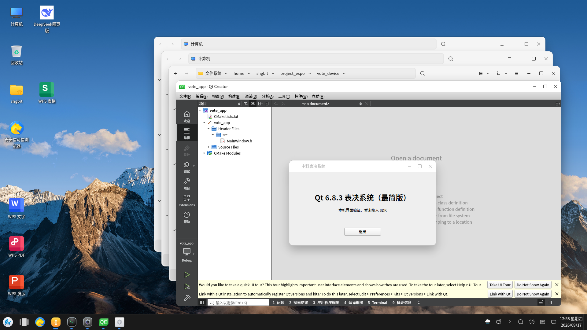
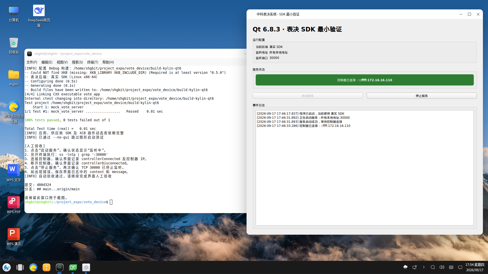

# 银河麒麟 Qt 6.8.3 环境安装操作手册

## 1. 文档说明

本文记录银河麒麟桌面操作系统 V10 SP1 2403（x86_64）安装 Qt 6.8.3、Qt Creator 14.0.2，以及构建 Qt Widgets 工程的操作方法。

本文对应的验证环境如下：

| 项目 | 版本或路径 |
| --- | --- |
| 操作系统 | 银河麒麟桌面操作系统 V10 SP1 2403 |
| glibc | 2.31 |
| GCC/G++ | 9.3.0 |
| GDB | 9.1 |
| 系统 Qt | 5.12.12，保留不变 |
| 用户 Qt | 6.8.3，`/home/shgbit/Qt/6.8.3/gcc_64` |
| Qt Creator | 14.0.2，`/home/shgbit/Qt/Tools/QtCreator-14.0.2` |
| CMake | 3.30.5，用户目录安装 |
| Ninja | 1.11.1，用户目录安装 |

安装过程中不得升级系统 glibc，不得替换系统 Qt5，也不得加入 Ubuntu、Debian 或第三方 PPA 软件源。

## 2. 脚本化安装（推荐）

仓库提供两个脚本，默认采用纯用户目录安装，不调用 `sudo`，也不会修改系统 Qt5、glibc、软件源或全局环境。

在银河麒麟桌面终端进入项目目录后执行：

```bash
cd /home/shgbit/project_expo/vote_device
./scripts/kylin/install-qt6.sh
```

安装脚本会自动完成：

- 检查 Kylin V10、x86-64、glibc、Python 3.8、磁盘空间和系统 Qt5。
- 检查 OpenGL、XCB 和 XKB 图形运行库。
- 在 `~/.local/share/qt-setup` 中安装 aqt、CMake 和 Ninja。
- 安装 Qt 6.8.3、Qt Creator 14.0.2、环境脚本和桌面入口。
- 验证 Qt6、Qt Creator、构建工具及系统 Qt5 状态。

脚本可以重复执行，已验证通过的组件会自动跳过。如果发现目标目录存在但安装不完整，脚本会停止并要求人工检查，不会删除或覆盖该目录。

安装完成后执行项目验收：

```bash
./scripts/kylin/verify-vote-device.sh
```

纯 SSH 或不希望启动图形窗口时执行：

```bash
./scripts/kylin/verify-vote-device.sh --no-gui
```

安装脚本本身不使用管理员权限。如果缺少系统图形库，脚本会停止并打印需要管理员执行的麒麟官方源安装命令；管理员补齐依赖后重新运行脚本即可。

## 3. 安装前检查

使用普通用户登录麒麟主机后执行：

```bash
cat /etc/os-release
uname -m
ldd --version | head -n 1
gcc --version | head -n 1
g++ --version | head -n 1
gdb --version | head -n 1
/usr/bin/qmake -v
df -h "$HOME"
```

应确认：

- 系统为 Kylin V10 SP1，架构为 `x86_64`。
- glibc 不低于 Qt 6.8 Linux 二进制要求的 2.28；本机为 2.31。
- `/usr/bin/qmake` 仍使用系统 Qt 5.12.12。
- 用户主目录至少预留 10GB 空间。

## 4. 安装系统依赖

以下命令需要 sudo 密码，只使用银河麒麟当前已配置的软件源：

```bash
sudo apt-get update
sudo apt-get install -y \
  python3.8-venv \
  cmake \
  ninja-build \
  libgl1-mesa-dev \
  libxcb-cursor0 \
  libxcb-xinerama0
```

推荐先运行第 2 节的纯用户安装脚本。只有脚本明确报告系统图形库缺失时，才由管理员执行上述命令。`libxcb-cursor0`、`libxcb-xinerama0` 等系统运行库必须通过银河麒麟官方软件源维护。

## 5. 安装 Qt 6.8.3

### 5.1 创建隔离安装工具

优先使用 Python 虚拟环境：

```bash
mkdir -p "$HOME/.local/share/qt-setup"
python3 -m venv "$HOME/.local/share/qt-setup/venv"
"$HOME/.local/share/qt-setup/venv/bin/pip" install "aqtinstall==3.1.18"
```

本次主机执行时尚未安装 `python3.8-venv`，因此实际采用了用户目录隔离方案。Python 3.8 需要固定兼容版本的 `py7zr` 和 `pyzstd`：

```bash
SETUP_ROOT="$HOME/.local/share/qt-setup"
PY_DEPS="$SETUP_ROOT/python-packages"
mkdir -p "$SETUP_ROOT/downloads" "$PY_DEPS"

curl -fL -o "$SETUP_ROOT/downloads/get-pip.py" \
  https://bootstrap.pypa.io/pip/3.8/get-pip.py
python3 "$SETUP_ROOT/downloads/get-pip.py" \
  --no-warn-script-location --target "$PY_DEPS"

PYTHONPATH="$PY_DEPS" python3 -m pip install \
  --no-warn-script-location --target "$PY_DEPS" \
  "pyzstd==0.15.9" "py7zr==0.20.8"

PYTHONPATH="$PY_DEPS" python3 -m pip install \
  --no-warn-script-location --target "$PY_DEPS" \
  bs4 defusedxml "humanize==4.10.0" patch requests semantic-version

PYTHONPATH="$PY_DEPS" python3 -m pip install \
  --no-warn-script-location --no-deps --target "$PY_DEPS" \
  "aqtinstall==3.1.18"
```

验证安装工具：

```bash
PYTHONPATH="$HOME/.local/share/qt-setup/python-packages" \
  python3 -m aqt version
```

### 5.2 下载 Qt

标准安装命令如下：

```bash
PYTHONPATH="$HOME/.local/share/qt-setup/python-packages" \
  python3 -m aqt install-qt \
  linux desktop 6.8.3 linux_gcc_64 \
  --outputdir "$HOME/Qt"
```

Qt 6.8.3 当前官方归档采用新的 RHEL 8.10 打包布局。若旧版 aqt 将内容直接展开到 `~/Qt` 并提示找不到 `6.8.3/gcc_64/mkspecs/qconfig.pri`，应把本次新增的 Qt 目录迁移到：

```text
/home/shgbit/Qt/6.8.3/gcc_64
```

同时把归档根目录中的 `libicu*.so.73*` 放入 `gcc_64/lib`。不要移动或删除 `~/Qt/Tools`。

完成后验证：

```bash
QT_ROOT="$HOME/Qt/6.8.3/gcc_64"
"$QT_ROOT/bin/qmake" -v
"$QT_ROOT/bin/qtpaths" --qt-version
file "$QT_ROOT/lib/libQt6Core.so.6"
/usr/bin/qmake -v
```

期望 Qt6 显示 `6.8.3`、库为 ELF 64-bit x86-64，最后一条命令仍显示 Qt 5.12.12。

## 6. 安装 Qt Creator 14.0.2

Qt Creator 14.0.2 官方文件位于 Qt 历史归档：

```text
https://download.qt.io/archive/qtcreator/14.0/14.0.2/
```

官方 `.run` 离线安装器可能要求已有 Qt Account 许可记录。无人值守环境可改用同一发布目录下的官方实验性 `.deb`，仅解压到用户目录，不注册为系统软件包：

```bash
SETUP_ROOT="$HOME/.local/share/qt-setup"
DOWNLOAD_DIR="$SETUP_ROOT/downloads"
BASE_URL="https://download.qt.io/archive/qtcreator/14.0/14.0.2/cpack_experimental"
PACKAGE="qtcreator-opensource-linux-x86_64-14.0.2.deb"
TARGET="$HOME/Qt/Tools/QtCreator-14.0.2"

mkdir -p "$DOWNLOAD_DIR" "$TARGET"
curl -fL -o "$DOWNLOAD_DIR/$PACKAGE" "$BASE_URL/$PACKAGE"
curl -fL -o "$DOWNLOAD_DIR/qtcreator-deb-md5sums.txt" "$BASE_URL/md5sums.txt"

cd "$DOWNLOAD_DIR"
grep " $PACKAGE$" qtcreator-deb-md5sums.txt | md5sum -c -
dpkg-deb -x "$PACKAGE" "$TARGET"
```

本次校验值为：

```text
e0b5d12e8cba43fb7fcf76d1bb1b778d  qtcreator-opensource-linux-x86_64-14.0.2.deb
```

验证二进制兼容性：

```bash
QT_QPA_PLATFORM=offscreen \
  "$HOME/Qt/Tools/QtCreator-14.0.2/opt/qt-creator/bin/qtcreator" -version
```

应显示 `Qt Creator 14.0.2 based on Qt 6.7.3`。如果出现 `GLIBC_x.x not found`，不得升级系统 glibc，应停止使用该二进制版本并改用命令行环境或在兼容环境中从源码构建 Qt Creator。

## 7. 使用用户级 Qt 环境

本机已创建：

```text
/home/shgbit/Qt/qt6-8.3-env.sh
```

每次使用前加载：

```bash
source "$HOME/Qt/qt6-8.3-env.sh"
qmake -v
qtpaths --qt-version
cmake --version
ninja --version
```

该脚本只设置当前终端的 `PATH`、`CMAKE_PREFIX_PATH` 和用户级构建工具所需的 `PYTHONPATH`，不会设置全局 `LD_LIBRARY_PATH`。

本次用户级 CMake 和 Ninja 的安装命令为：

```bash
SETUP_ROOT="$HOME/.local/share/qt-setup"
PY_DEPS="$SETUP_ROOT/python-packages"
BUILD_TOOLS="$SETUP_ROOT/build-tools"

PYTHONPATH="$PY_DEPS" python3 -m pip install \
  --no-warn-script-location --target "$BUILD_TOOLS" \
  "cmake==3.30.5" "ninja==1.11.1.4"
```

## 8. Qt Creator Kit

从麒麟应用菜单选择 `Qt Creator 14.0.2 (Qt 6.8.3)`，或执行：

```bash
"$HOME/Qt/qtcreator-14.0.2"
```

启动脚本使用独立配置目录：

```text
/home/shgbit/.config/QtProject/qtcreator-14.0.2
```

因此不会覆盖主机原有 Qt Creator 4.11 和 Qt5 Kit。Qt Creator 14 首次启动已自动发现：

- Qt 6.8.3：`/home/shgbit/Qt/6.8.3/gcc_64/bin/qmake`
- 系统 Qt 5.12.12：`/usr/lib/qt5/bin/qmake`
- C/C++ 编译器：`/usr/bin/gcc`、`/usr/bin/g++`
- 调试器：`/usr/bin/gdb`
- CMake/Ninja：环境脚本中的用户级工具

首次从 `PATH` 自动发现 Qt6 时，Qt Creator 可能把 Kit 显示为 `Qt 6.8.3 in PATH (gcc_64) - 临时`。其中“临时”是 Qt Creator 自动生成的状态名称，并非安装脚本手工命名，不影响编译和运行。

建议在 `编辑 -> Preferences -> Kits` 中选中该 Kit，将名称改为 `Desktop Qt 6.8.3 Kylin x86_64`，并确认使用上述工具路径。改名只影响 Qt Creator 中的显示名称，不会改变 Qt 安装目录或构建结果。

## 9. 构建和运行 vote_app

源码目录：

```text
/home/shgbit/project_expo/vote_device
```

构建命令：

```bash
source "$HOME/Qt/qt6-8.3-env.sh"
cd "$HOME/project_expo/vote_device"

qt-cmake -S . -B build-kylin-qt6 -G Ninja \
  -DCMAKE_BUILD_TYPE=Debug
cmake --build build-kylin-qt6 --parallel
```

动态库检查：

```bash
ldd build-kylin-qt6/vote_app | grep 'not found' || echo 'vote_app 依赖完整'
ldd "$QT_ROOT/plugins/platforms/libqxcb.so" | grep 'not found' \
  || echo 'XCB 插件依赖完整'
```

桌面终端运行：

```bash
./build-kylin-qt6/vote_app
```

本次验收结果：

- CMake 配置、Ninja 编译和链接成功。
- `vote_app` 为 x86-64 ELF 可执行文件，包含调试信息。
- 应用和 `libqxcb.so` 的 `ldd` 结果均无 `not found`。
- 应用在麒麟 X11 桌面 `:0` 中启动成功并持续进入窗口事件循环。

### 9.1 运行成功截图

下图为 2026 年 9 月 17 日在银河麒麟主机上的实际运行画面。Qt Creator 已载入 `vote_app` 工程，前台程序显示 Qt 6.8.3，证明 Qt6 Kit、CMake/Ninja 构建链和桌面图形运行环境均已正常工作。



### 9.2 最小 SDK 自动验证成功截图

下图为 2026 年 9 月 17 日在银河麒麟主机上执行 `./scripts/kylin/verify-vote-device.sh --no-gui` 后的实际结果。终端显示 Mock 自动测试全部通过，应用、供应商 SDK 和 XCB 插件的动态库依赖完整；同一桌面中的真实 SDK 界面已监听 TCP 30000，并收到控制器 `172.16.16.110` 的连接事件。



## 10. 常见问题

### 10.1 `libicui18n.so.73: cannot open shared object file`

确认 Qt 官方随附的 ICU 库位于：

```text
/home/shgbit/Qt/6.8.3/gcc_64/lib
```

不要通过全局 `LD_LIBRARY_PATH` 解决，否则可能影响系统 Qt5 程序。

### 10.2 `could not connect to display`

SSH 会话默认没有图形显示变量。应在麒麟桌面终端启动；远程验证时可使用当前桌面会话：

```bash
export DISPLAY=:0
export XAUTHORITY="$HOME/.Xauthority"
```

### 10.3 `Could not load the Qt platform plugin "xcb"`

检查插件依赖：

```bash
ldd "$HOME/Qt/6.8.3/gcc_64/plugins/platforms/libqxcb.so" \
  | grep 'not found'
```

缺少的包必须从银河麒麟官方软件源安装。常见包包括 `libxcb-cursor0`、`libxcb-xinerama0` 和 `libxkbcommon-x11-0`。

### 10.4 Qt Creator 没有识别 Qt6

必须通过 `~/Qt/qtcreator-14.0.2` 启动，使 Qt6 的 `qmake` 位于 `PATH` 前部。也可以在 Qt Versions 中手工添加：

```text
/home/shgbit/Qt/6.8.3/gcc_64/bin/qmake
```

### 10.5 CMake 提示找不到 XKB

如果当前 Widgets 工程仍能配置、编译、运行，该提示不影响本项目。需要开发相关功能时，由管理员从麒麟软件源安装对应的 XKB 开发包，不要混入其他发行版软件源。

## 11. 卸载与回退

关闭 Qt Creator 和所有 Qt6 应用后，只删除用户目录中的本次安装内容：

```bash
rm -rf "$HOME/Qt/6.8.3"
rm -rf "$HOME/Qt/Tools/QtCreator-14.0.2"
rm -rf "$HOME/.local/share/qt-setup"
rm -rf "$HOME/.config/QtProject/qtcreator-14.0.2"
rm -f "$HOME/Qt/qt6-8.3-env.sh"
rm -f "$HOME/Qt/qtcreator-14.0.2"
rm -f "$HOME/.local/share/applications/qtcreator-14.0.2.desktop"
rm -rf "$HOME/project_expo/vote_device/build-kylin-qt6"
```

回退后确认系统 Qt5 未受影响：

```bash
/usr/bin/qmake -v
```

不得卸载银河麒麟系统 Qt5 软件包，不得删除 `/usr/lib/x86_64-linux-gnu` 中的系统库。
